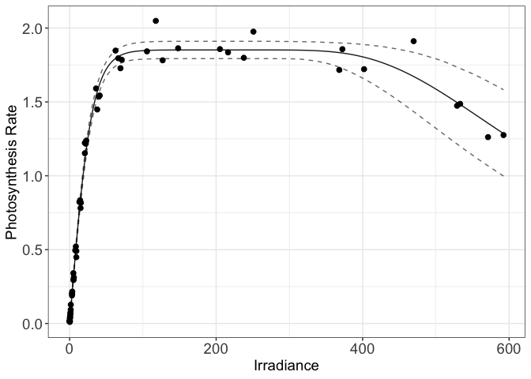
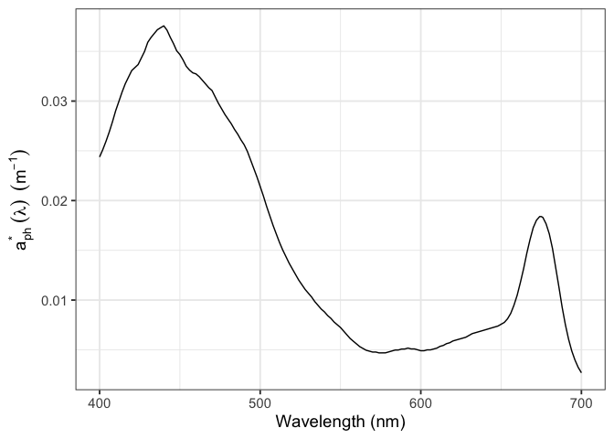
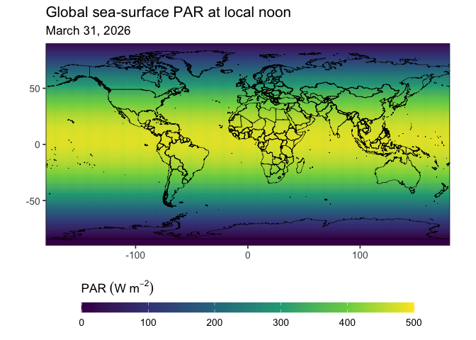

## Overview

The piCurve package offers a comprehensive suite of
photosynthesis–irradiance (PI) models in a user-friendly environment,
enabling users to explore how varying irradiance levels influence
photosynthetic or growth rates using statistical methods. The models
have been rigorously tested and validated against experimental data,
ensuring both reliability and accuracy. In total, 24 PI models are
included this library (`?Model_piCurve`). Optimal parameters for each
model formulation are estimated through non-linear optimization using
two statistical approaches: mean squared error (MSE) and maximum
likelihood estimation (MLE). A built-in dataset (`?piDataSet`)
containing eight independent PI incubation samples is included for model
testing and validation.

In addition to PI-curve fitting, **piCurve package now provides tools
for radiative transfer and optical modelling**, including:

-   Estimation of **downwelling spectral irradiance** at the sea surface
    using a Gregg–Carder–type parameterization with climatological
    atmospheric inputs.
-   Computation of **photosynthetically available radiation (PAR)** by
    spectrally integrating downwelling irradiance.
-   Estimation of **phytoplankton absorption coefficients** from
    chlorophyll-a concentration using established bio-optical
    parameterizations.

These capabilities enable users to link physiological photosynthesis
models with environmental forcing, facilitating analyses ranging from
single-experiment PI curve fitting to regional or global assessments of
marine primary productivity.

## Installation

Install the package from GitHub:

``` r
remotes::install_github("Mohammad-Amirian/piCurve")
```

## How to use piCurve

``` r
library(piCurve)
library(ggplot2)
```

    ## Warning: package 'ggplot2' was built under R version 4.3.3

``` r
library(dplyr)
library(maps)
```

    ## Warning: package 'maps' was built under R version 4.3.3

``` r
library(grid)
```

### Classfying Data

To classify PI data as light-limited (ll), light-saturated (ls), or
photoinhibited (ph), you can use the `DataType_piCurve()` function.
Below, we demonstrate how to apply this function to the built-in
dataset.

``` r
# Split the data
grouped <- 
    piDataSet |> 
    dplyr::group_by(pi_number) |> 
    dplyr::group_split()

# Extract pi_number values
pi_numbers <- 
    piDataSet |> 
    dplyr::group_by(pi_number) |> 
    dplyr::group_keys() |> 
    dplyr::pull(pi_number)

# Apply function and combine with pi_number
result_df <- data.frame(
    pi_number = pi_numbers,
    data_type = unlist(parallel::mclapply(grouped, function(x) DataType_piCurve(data = x, n_cores = 1)$data_type, mc.cores = 6))
)
 
dplyr::count(result_df, data_type)
```

    ##   data_type n
    ## 1        ls 4
    ## 2        ph 4

# Model Fitting

To fit a PI model to a given data sample, you can use the
`Fit_piModel()` function. In the example below, we use the default
settings of this function, which fits the Amirian–tanh model (Ph10; see
`?Model_piCurve()`) to the data, assuming a dark reaction rate of zero
(R = 0). This model is chosen because it provides coherent and
consistent outputs. For more details, please refer to the associated
reference.

``` r
df <- grouped[[5]]

# fit model on a given data
fit <- Fit_piModel(data = df, STATapp = "MLE", Hessian = TRUE)

print(fit)
```

    ## $par
    ##        Pmax       alpha        beta       StDev 
    ## 1.852016996 0.061371599 0.003337527 0.063776649 
    ## 
    ## $value
    ## [1] -80.00742
    ## 
    ## $counts
    ## function gradient 
    ##      325       NA 
    ## 
    ## $convergence
    ## [1] 0
    ## 
    ## $message
    ## NULL
    ## 
    ## $hessian
    ##                Pmax        alpha         beta         StDev
    ## Pmax    7615.940697 1.139034e+04 8.674185e+05 -1.080748e+00
    ## alpha  11390.339148 5.140572e+05 5.835343e-02  1.240775e+02
    ## beta  867418.505124 5.835343e-02 1.647622e+08  1.170479e+06
    ## StDev     -1.080748 1.240775e+02 1.170479e+06  2.956539e+04
    ## 
    ## $info_criteria
    ##       AIC      AICc       BIC 
    ## -152.0148 -151.2876 -143.6375 
    ## 
    ## $model
    ## [1] "ph10"
    ## 
    ## $SQA
    ##        R2     R2adj 
    ## 0.9925895 0.9921925

### Tidy Fit

You can use the `Tidy_piCurve()` function to convert the output of your
model fit into a tidy tibble format.

``` r
# tidy the output of the model
Tidy_piCurve(fit)$params
```

    ## # A tibble: 4 × 5
    ##   params Est_Val  Est_Err `LB_95%` `UB_95%`
    ##   <chr>    <dbl>    <dbl>    <dbl>    <dbl>
    ## 1 Pmax   1.85    0.0315    1.79     1.91   
    ## 2 alpha  0.0614  0.00156   0.0583   0.0644 
    ## 3 beta   0.00334 0.000248  0.00285  0.00382
    ## 4 StDev  0.0638  0.0114    0.0414   0.0862

### Plotting

You can use the `Plot_piCurve()` function to visualize the fitted model
output along with the predicted interval (95% by default) over the data.

``` r
p <- # plot the fitted model 
    Plot_piCurve(fit, df, length_out = 200, add_CI = TRUE, n_cores = 6)

p + # increase the size of axis title and font
    theme(axis.text = element_text(size = 14), axis.title = element_text(size = 14))
```



### Other Useful Functions

In addition to the core functions described above, the piCurve package
includes several other helpful tools for model analysis and
interpretation. A few of them are highlighted below.

If the user forgot to set `Hessian = TRUE` when using the
`Fit_piModel()` function, the information matrix can still be calculated
afterward using the `InfoMat_piCurve()` function, as shown below:

``` r
InfoMat_piCurve(parameters = fit$par, model_name = fit$model, data = df)
```

    ##                Pmax         alpha          beta         StDev
    ## Pmax   7.615941e+03  1.139034e+04 -8.674185e+05 -1.080748e+00
    ## alpha  1.139034e+04  5.140572e+05 -5.835343e-02  1.240775e+02
    ## beta  -8.674185e+05 -5.835343e-02  1.647622e+08 -1.170479e+06
    ## StDev -1.080748e+00  1.240775e+02 -1.170479e+06  2.956539e+04

To add confidence intervals to the predicted response variable (`y`),
you can use the `addCI_to_piPred()` function.

``` r
addCI_to_piPred(Fitted_Model = fit, irrad = df$I) |> head(3)
```

    ## # A tibble: 3 × 3
    ##   irradiance    ymin    ymax
    ##        <dbl>   <dbl>   <dbl>
    ## 1     0.0846 0.00495 0.00544
    ## 2     0.127  0.00742 0.00816
    ## 3     0.169  0.00990 0.0109

To increase the resolution of prediction value across a finer irradiance
space, you can use `?highRes_piPred()` function. List of models are also
listed in `?Model_piCurve()`.

## Phytoplankton Absorption Coefficient

Chlorophyll-a–specific phytoplankton absorption,
*a*<sub>*p**h*</sub><sup>\*</sup>(*λ*), and the corresponding
phytoplankton absorption coefficient, *a*<sub>*p**h*</sub>(*λ*), can be
estimated from chl-a concentration using the empirical spectral
parameterization of Bricaud et al. (1995). This approach provides a
globally averaged relationship between chlorophyll concentration and
phytoplankton absorption in the absence of direct optical measurements
(Details `?absCoef`). Below is an example illustrating the computation
and visualization of *a*<sub>*p**h*</sub>(*λ*) for a chl-a concentration
of 0.9 mg m<sup>−3</sup>.

``` r
absCoef(chla = 0.9) |>
    ggplot(aes(x = lambda_nm, y = a_ph)) +
    geom_line() +
    theme_bw(base_size = 14) +
    labs(
        x = "Wavelength (nm)",
        y = expression(a[ph]^"*"~(lambda)~~(m^{-1}))
    )
```



## Photosynthetically Available Radiation

Photosynthetically available radiation (PAR) is estimated by integrating
downwelling spectral irradiance across the 400–700 nm photosynthetically
active waveband. In **piCurve**, sea-surface spectral irradiance is
computed using a Gregg–Carder–type parameterization with climatological
atmospheric inputs (details: `?sea_surface_irradiance_piCurve`),
providing a practical approach for estimating PAR in the absence of
direct irradiance measurements. Below is an example illustrating the
computation and visualization of PAR for a given date and solar zenith
angle.

``` r
PAR_sea_surface_piCurve(
  zenith_angle = 30,
  database_info = GreggCarder1990,
  sample_date = "2024-07-24"
)
```

    ##   lambda_min lambda_max  units      PAR
    ## 1        400        700 W m^-2 413.1315

When not provided, the solar zenith angle can be computed from
geographic coordinates (latitude and longitude) and time using
`?solar_zenith_angle_piCurve`. Building on this, the figure below
illustrates the global distribution of sea-surface PAR at local noon on
March 31, 2026.

``` r
Date <- as.Date("2026-03-31")

lat <- 0
long <- 0

sza <- 
    solar_zenith_angle_piCurve(date = Date, time = "12:00:00", latitude = lat, longitude = long)

PAR_sea_surface_piCurve(zenith_angle = sza, GreggCarder1990, sample_date = Date)
```

    ##   lambda_min lambda_max  units      PAR
    ## 1        400        700 W m^-2 479.4463

``` r
#--------------------------------------------------
# 1. Create global grid
#--------------------------------------------------
df_global <- 
    expand.grid(
        longitude = seq(-180, 180, by = 2),
        latitude  = seq(-90, 90, by = 2)
        ) |>
    as_tibble()

#--------------------------------------------------
# 2. Compute solar zenith angle
#--------------------------------------------------
df_global <-
    df_global |>
    mutate(
        sza = mapply(
            FUN = function(lat, lon) {
                solar_zenith_angle_piCurve(
                    date      = Date,
                    time      = "12:00:00",
                    latitude  = lat,
                    longitude = lon
                )
            },
            lat = latitude,
            lon = longitude
        )
    )

#--------------------------------------------------
# 3. Compute PAR
#    If sun is below horizon / zenith >= 90, set PAR = 0
#--------------------------------------------------
df_global <-
    df_global |>
    rowwise() |>
    mutate(PAR = ifelse(
        is.na(sza) || sza >= 90,
        0,
        PAR_sea_surface_piCurve(
            zenith_angle  = sza,
            database_info = GreggCarder1990,
            sample_date   = Date
        )$PAR[1]
    )) |>
    ungroup()

#--------------------------------------------------
# 4. Plot global PAR map
#--------------------------------------------------
world_map <- map_data("world")

ggplot() +
    geom_raster(data = df_global,
                aes(x = longitude, y = latitude, fill = PAR)) +
    geom_polygon(
        data = world_map,
        aes(x = long, y = lat, group = group),
        fill = NA,
        color = "black",
        linewidth = 0.2
    ) +
    coord_fixed(xlim = c(-180, 180),
                ylim = c(-90, 90),
                expand = FALSE) +
    scale_fill_viridis_c(
        name = expression(PAR ~ (W ~ m ^ -2)),
        limits = c(0, 500),
        breaks = seq(0, 500, by = 100),
        guide = guide_colorbar(
            direction = "horizontal",
            barwidth  = unit(0.7, "npc"),
            barheight = unit(0.03, "npc"),
            title.position = "top",
            label.position = "bottom"
        )
    ) +
    labs(
        title = "Global sea-surface PAR at local noon",
        subtitle = "March 31, 2026",
        x = "",
        y = ""
    ) +
    theme_bw(base_size = 13) +
    theme(legend.position = "bottom", axis.title = element_blank())
```



## Citation

This package is developed based on the research outlined in the
following paper. If you utilize the `piCurve` package in your work, we
kindly request that you cite the referenced publication.

M. Amirian, M., Finkel, Z.V., Devred, E., Irwin, A.J. “*Parameterization
of photoinhibition for phytoplankton*”. Commun Earth Environ 6, 707
(2025). <https://doi.org/10.1038/s43247-025-02686-3>

M. Amirian, M. and Irwin, A.J. “*piCurve: an R package for modeling
photosynthesis–irradiance curves*”. arXiv preprint arXiv:2508.14321v1,
(2025). <https://arxiv.org/abs/2508.14321>
