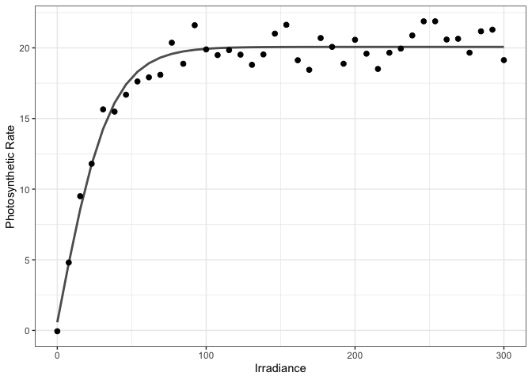

## Overview

The **piCurve** package integrates a diverse range of photosynthesis
irradiance (PI) models, providing a user-friendly environment for users
to explore the effects of different irradiance levels on photosynthetic
rate using statistical methods. The models have been rigorously tested
and validated against experimental data, ensuring their reliability and
accuracy. The optimal parameters of the each formulation get estimated
through non-linear optimization using two statistical approaches: MSE
and MLE.

## How to use piCurve

``` r
rm(list = ls())
devtools::load_all()
```

    ## ℹ Loading piCurve

``` r
library(piCurve)
library(ggplot2)
library(viridis)
```

    ## Loading required package: viridisLite

``` r
library(fBasics)
```

### Light-saturation models

The following data sample is given where `I` and `PP` stand for
irradiance and photosynthetic rate, respectively.

``` r
head(round(df, digits = 2), 5)
```

    ## # A tibble: 5 × 2
    ##       I    PP
    ##   <dbl> <dbl>
    ## 1  0    -0.06
    ## 2  7.69  4.81
    ## 3 15.4   9.5 
    ## 4 23.1  11.8 
    ## 5 30.8  15.6

To find the optimal parameters for the embed formulations with `MSE`
method, one can specify `STATapp = "MSE"` or leave that empty. The
default approach is set on `MSE`. See the following example.

``` r
fit_mse <-
    OptPar_piCurve(
        parameters = params,
        model_name = "tanh",
        data = df,
        data_type = "ls"
    )

fit_mse
```

    ## $par
    ##       Pmax      alpha          R 
    ## 19.4918640  0.5520826  0.5778523 
    ## 
    ## $value
    ## [1] 0.9292517
    ## 
    ## $counts
    ## function gradient 
    ##      183       NA 
    ## 
    ## $convergence
    ## [1] 0
    ## 
    ## $message
    ## NULL
    ## 
    ## $model
    ## [1] "tanh"
    ## 
    ## $SQA
    ##        R2     R2adj 
    ## 0.9526224 0.9500614

For `MLE` method, one simply needs to specify `STATapp = "MLE"`. See the
following example

``` r
fit_mle <-
    OptPar_piCurve(
        parameters = c(params, StDev = 2),
        model_name = "tanh",
        data = df,
        # Hessian = TRUE,
        STATapp = "MLE",
        data_type = "ls"
    )

fit_mle
```

    ## $par
    ##       Pmax      alpha          R      StDev 
    ## 19.4906004  0.5520385  0.5790616  0.9640312 
    ## 
    ## $value
    ## [1] 55.29003
    ## 
    ## $counts
    ## function gradient 
    ##      327       NA 
    ## 
    ## $convergence
    ## [1] 0
    ## 
    ## $message
    ## NULL
    ## 
    ## $info_criteria
    ##      AIC     AICc      BIC 
    ## 118.5801 119.7229 125.3356 
    ## 
    ## $model
    ## [1] "tanh"
    ## 
    ## $SQA
    ##        R2     R2adj 
    ## 0.9526224 0.9486743

In case if, the user forgot to set `Hessian = TRUE`, the information
matrix can be calculated using `InfoMat_piCurve` as shown below.

``` r
fit_mle$hessian <-
    InfoMat_piCurve(
        parameters = fit_mle$par,
        model_name = fit_mle$model,
        data = df,
        data_type = "ls"
    )

fit_mle$hessian 
```

    ##               Pmax         alpha            R        StDev
    ## Pmax  33.596970269   52.86997727  35.65604862 -0.001080808
    ## alpha 52.869977269 1211.58086626 120.17158129 -0.035297433
    ## R     35.656048617  120.17158129  43.04054993 -0.006388650
    ## StDev -0.001080808   -0.03529743  -0.00638865 86.067422165

visualizing the fit

``` r
df$P_est <-
    Model_piCurve(
        fit_mle$par,
        model_name = fit_mse$model,
        data_type = "ls",
        data = df
    )

df |> 
    ggplot(aes(I, PP)) + 
    geom_point(size = 2) + 
    geom_line(aes(x = I, y = P_est), linewidth = 1, alpha = 0.7) +
    theme_bw() +
    labs(x = "Irradiance", y = "Photosynthetic Rate")
```



#### Confidence Interval

To calculate CI, `MLE` method must be used with `Hessian = TRUE`. Then,
one simply needs to use `ConfInt_piModel()` function as shown below.

``` r
ConfInt_piCurve(Fitted_Model = fit_mle)
```

    ##  Est_Err.Pmax Est_Err.alpha     Est_Err.R Est_Err.StDev     L_CI.Pmax 
    ##    0.79789501    0.05430759    0.80005384    0.10779053   17.92675496 
    ##    L_CI.alpha        L_CI.R    L_CI.StDev     U_CI.Pmax    U_CI.alpha 
    ##    0.44559761   -0.98901515    0.75276564   21.05444593    0.65847946 
    ##        U_CI.R    U_CI.StDev 
    ##    2.14713827    1.17529676

### Photoinhibition models

Similar to above, one can alter the codes to photoinhibition models. A
list of models can be found under details in `?Model_piCurve()`.
Consider the following data sample, let’s fit double-tanh (Ph10) model
on it.

``` r
head(df, 3)
```

    ## # A tibble: 3 × 2
    ##       I      PP
    ##   <dbl>   <dbl>
    ## 1  0    -0.0570
    ## 2  7.69  6.24  
    ## 3 15.4  11.8

``` r
fit_mle <-
    OptPar_piCurve(
        parameters = c(params, StDev = 2),
        model_name = "2tanh",
        data = df,
        STATapp = "MLE",
        data_type = "ph"
    )

fit_mle
```

    ## $par
    ##        Pmax       alpha        beta           R       StDev 
    ## 19.11427426  0.78938410  0.09420309  0.53500655  0.92564668 
    ## 
    ## $value
    ## [1] 53.67205
    ## 
    ## $counts
    ## function gradient 
    ##      501       NA 
    ## 
    ## $convergence
    ## [1] 1
    ## 
    ## $message
    ## NULL
    ## 
    ## $info_criteria
    ##      AIC     AICc      BIC 
    ## 117.3441 119.1088 125.7885 
    ## 
    ## $model
    ## [1] "2tanh"
    ## 
    ## $SQA
    ##        R2     R2adj 
    ## 0.9641352 0.9600364

visualizing the fit

``` r
df$P_est <-
    Model_piCurve(
        fit_mle$par,
        model_name = fit_mle$model,
        data_type = "ph",
        data = df
    )

df |> 
    ggplot(aes(I, PP)) + 
    geom_point(size = 2) + 
    geom_line(aes(x = I, y = P_est), linewidth = 1, alpha = 0.7) +
    theme_bw() +
    labs(x = "Irradiance", y = "Photosynthetic Rate")
```


## Citation

This package is developed based on the research outlined in the
following paper. If you utilize the `piCurve` package in your work, we
kindly request that you cite the referenced publication.

Mohammad Amirian, Emmanuel Devred, Zoe V. Finkel, Andrew J. Irwin. “*An
improved parameterization of photoinhibition in phytoplankton
photosynthesis-irradiance curves*,” xxx 2024.
